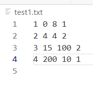

# CPU Scheduling Simulator  
### GitHub Link for this program  
https://github.com/Chau-Nguyen-Developer/cpu-scheduling-simulator

### What is this about?  

This program stmulates the following CPU scheduling algorirthms:  
1. First Come First Serve (FCFS) (done)  
2. Shortest Job First (SJF) (under construction)
3. Preemptive Priority Scheduling  (under construction)
4. Round Robin (RR) (under construction)

The task information will be read from an input file witht the following format
```  
Pid Arrival_Time Burst_Time Priority
```

All fields are integer type.   
Unit for time: milliseconds  
```Pid``` is a unique numberic process ID  
```Arrival_Time``` is the time when the task arrives  
```Burst_Time``` is the CPU time requested by a task  
```Priority``` is the priority associated with each task. Low numbers = High priority.  

Note: For RR algorithm, user can modify their chosen Time-Quantum number.  

Example  



### What you as a user can expect when this project finishes   
A simple user interface (a prompt in command line) will pop up to ask you for your input (.txt) file, your chosen CPU Scheduling Algorithm, and Time Quantum (if Round Robin is chosen.)  

Print progress of task every unit time (millisecond).
Once all tasks are completed, the program should compute and print:
* Average waiting time
* Average response time
* Average turn-around time
* CPU Utilization Rate 
### Note:  
FCFS Algorithm is ready to be used. The rest are under construction. Please stay tuned. 

### Draft Outline
#### Part 1
[✔] Read from file  
[✔] Populate info to each process instances
#### Part 2. First Come First Serve
[✔]Sort pocesses based on their arrive time.  
[✔]Create the scheme who go first and who go next    
[✔]Wait time of a process = its start time - its arrival time  
[✔]Response time = wait time  
[✔]Process time = Burst time    

#### Part 3. Shortest-Job First

#### Part 4. Round Robin with Quantum Time = 50

#### Part 5. Create prompt to ask users for their file
[✔]Prompt

#### Part 6. Create prompt to ask users which algorithm they want
